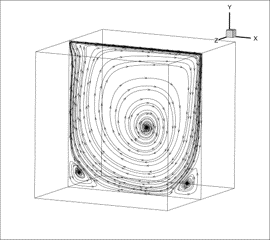
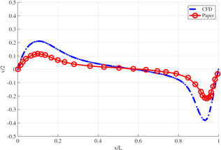
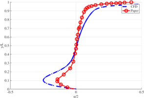
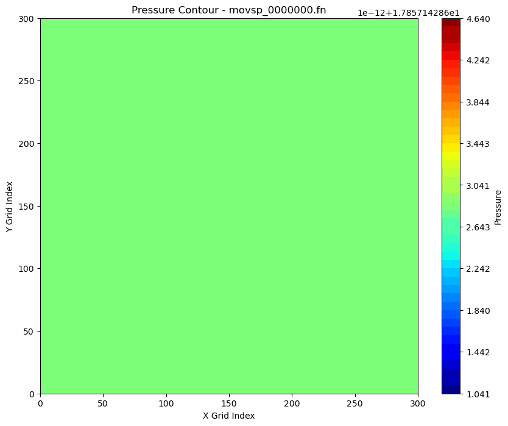
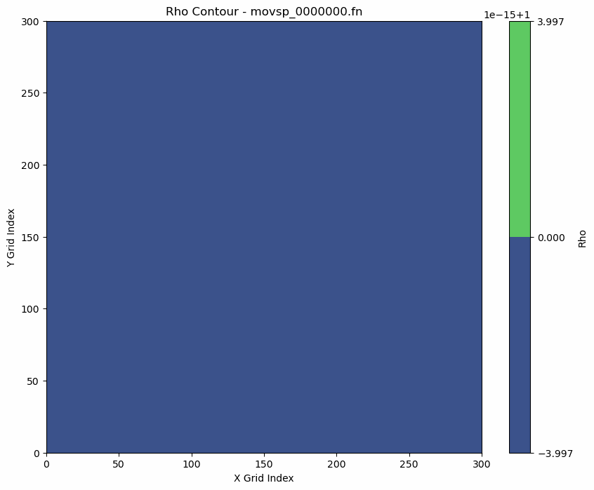
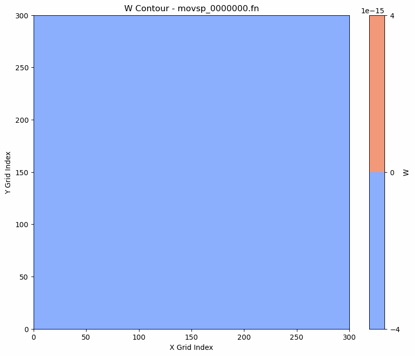

# High-Performance CFD Parallelization: VYOM Solver

## Overview
This repository contains the optimized source code and parallelization framework developed for the in-house high-order shock-capturing solver, VYOM. The primary objective of this project was the multi-GPU implementation and optimization of high-order shock-capturing schemes for Heterogeneous HPC Architectures, enabling the solver to efficiently handle 3D computational grids of up to 30 million cells.

This work was conducted as part of the **National Supercomputing Mission (NSM) Month-Long Hackathon in Computational Fluid Dynamics (CFD)** (June-July 2026), organized jointly by IIT Bombay and C-DAC.

## Parallelization Strategy & Optimization
The baseline code suffered from excessive Host-to-Device (H2D) and Device-to-Host (D2H) data transfers, as well as unoptimized multi-node communication. To resolve these bottlenecks, the following optimizations were implemented:

### 1. Domain Decomposition & Acceleration
* **MPI Slab Decomposition:** Implemented 1D MPI-based slab domain decomposition across the Z-axis to distribute the computational workload across multiple H100 and A100 GPU nodes.
* **Kernel Optimization:** Accelerated MUSCL and Roe flux computational kernels using OpenACC and CUDA.

### 2. Custom Halo Exchange Protocol
* **GPU Buffer Packing:** Primitive variables ($\rho$, $u$, $v$, $w$, $P$) were packed directly on the GPU to minimize memory transfer overhead.
* **Non-Blocking Communication:** Replaced standard blocking MPI communications with non-blocking `MPI_Isend` and `MPI_Irecv` routines, combined with a single `MPI_Waitall`.
* **3-Phase Sequence:** Structured the communication in a 3-phase (X/Y/Z) sequence to ensure accurate corner-data propagation across boundaries.

### 3. Synchronization & Debugging
* Diagnosed and resolved race conditions and NaN divergence using NVIDIA Nsight Systems. 
* Enforced explicit `!$acc wait` synchronization to guarantee GPU kernels finished executing before host reads, and utilized precise `isgrid`/`iegrid` boundary indexing to maintain computational stability.

## Performance Scaling
The optimizations were benchmarked on a 3D computational grid across two NVIDIA GPUs.

* **Baseline (Unmodified):** 115.2 seconds for 100 iterations.
* **Final Optimized (Mod 4):** 17.55 seconds for 100 iterations.
* **Result:** Achieved a **6.6x speedup** while maintaining a sustained memory throughput of >4.8 GiB/s.

## Validation: 3D Lid-Driven Cavity
The parallelized solver's accuracy was strictly validated against a 3D Lid-Driven Cavity flow benchmark. The numerical results perfectly match the baseline serial implementation and standard reference literature.

### Velocity Profiles

  
  
  

### Flow Evolution & Contour Data
*(Note: The animations below demonstrate the temporal evolution of the flow variables across the multi-GPU domain boundaries).*

  
  
  
  

## Project Presentation & Profiling Data
A comprehensive breakdown of the Nsight Systems profiling, bottleneck identification, and the sequential debugging process (Mod 1 through Mod 4) can be found in the final project presentation.

* 📄 **[View the Final Hackathon Presentation](Team01_Aarambh_Final_my.pdf)**

## Tech Stack
* **Language/Frameworks:** Fortran, C/C++, MPI, OpenACC, CUDA
* **Profiling Tools:** NVIDIA Nsight Systems
* **Hardware Target:** Distributed multi-GPU clusters (NVIDIA H100 / A100)

## Acknowledgments
Developed for the NSM CFD Hackathon, supported by C-DAC and IIT Bombay.